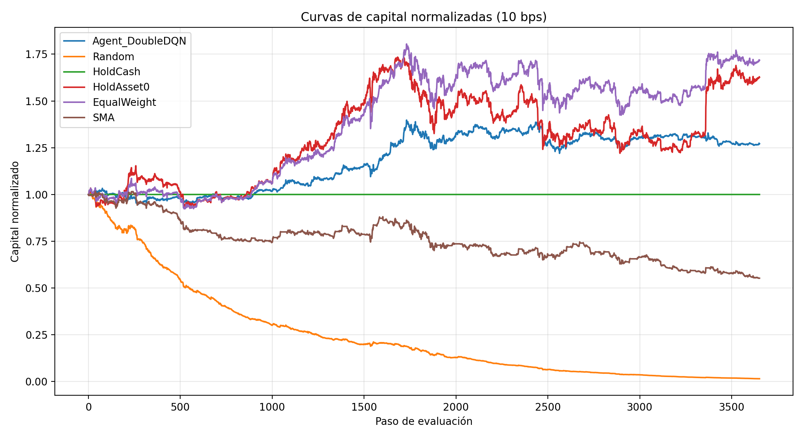
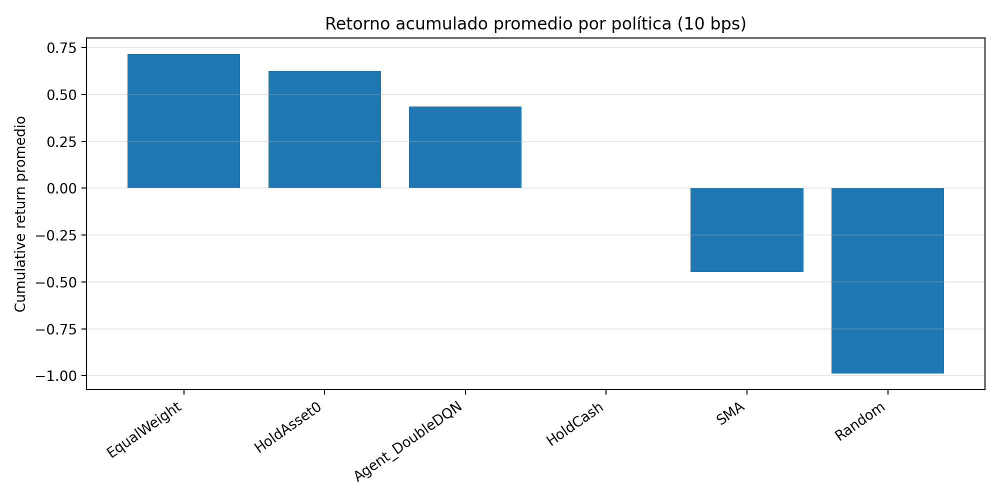
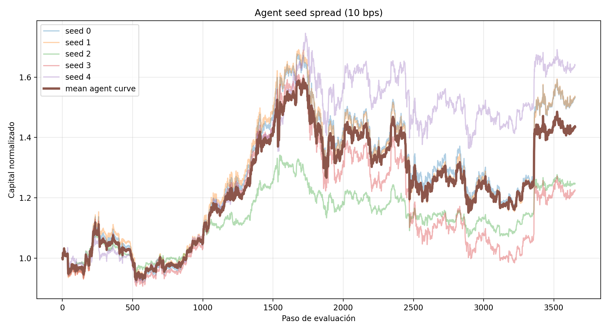
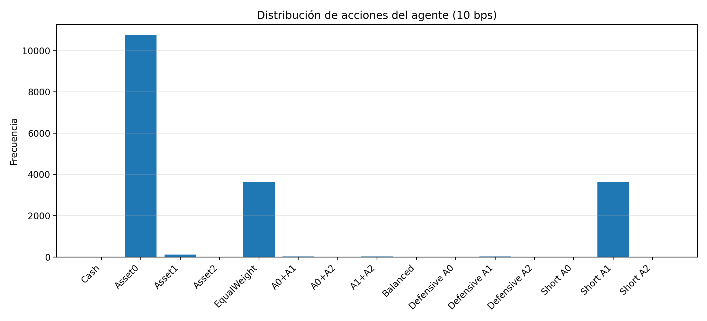
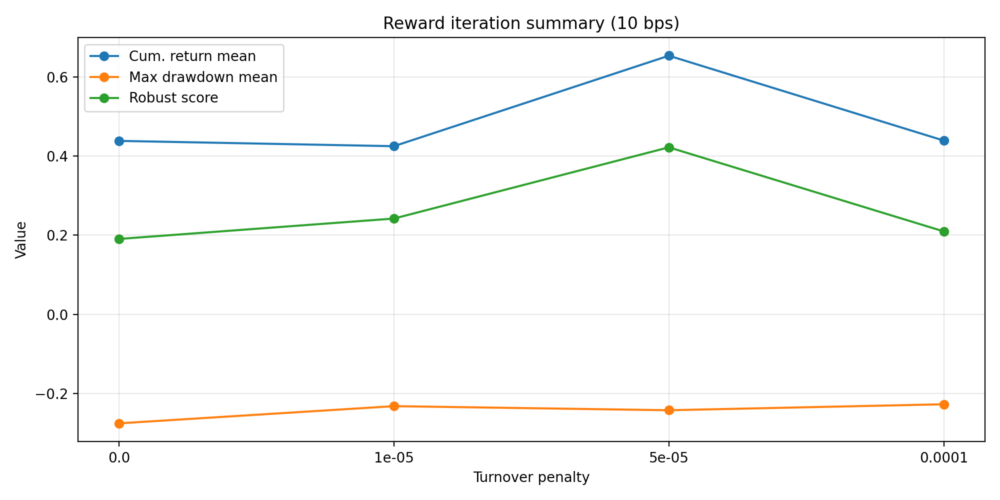

# Bellman Capital: Reinforcement Learning para asignación de portafolio

Este proyecto implementa un agente de aprendizaje por refuerzo para asignación dinámica de capital entre cuatro activos: tres activos riesgosos (`asset_0`, `asset_1`, `asset_2`) y un activo defensivo (`cash`).

El archivo principal de entrega es:

```text
agent.py
```

Este archivo define los elementos requeridos por el framework del proyecto:

```text
TradingEnv
Agent
N_ACTIONS
_ACTION_WEIGHTS
```

La solución final implementa un agente **Double DQN con arquitectura Dueling DQN**, un espacio de acciones discreto e interpretable, y una recompensa basada en log-retorno con regularización por turnover.

---

## 1. Resumen del proyecto

El objetivo no fue únicamente maximizar retorno, sino construir una solución metodológicamente defendible. Por eso el proyecto se enfocó en:

- evitar lookahead;
- usar costos de transacción;
- comparar contra baselines;
- evaluar en un período held-out;
- analizar estabilidad por múltiples seeds;
- justificar el diseño del estado, acción, recompensa y algoritmo;
- documentar limitaciones reales del uso de RL en datos financieros.

La conclusión principal es que el agente aprende una política rentable e interpretable, más robusta que políticas activas de alta rotación bajo costos de transacción, aunque no supera de forma consistente a estrategias pasivas simples como `EqualWeight` o `HoldAsset0`.

---

## 2. Archivo de entrega

El archivo oficial para evaluación es:

```text
agent.py
```

Este archivo contiene:

- `TradingEnv`: subclase del ambiente de trading.
- `Agent`: agente Double DQN.
- `N_ACTIONS`: número total de acciones discretas.
- `_ACTION_WEIGHTS`: menú de portafolios disponibles.
- `DEFAULT_TURNOVER_PENALTY`: penalización final seleccionada para regularizar turnover.

La versión final usa:

```text
DEFAULT_TURNOVER_PENALTY = 0.00005
```

Este valor fue seleccionado después de una iteración experimental de recompensas. La penalización no reemplaza los costos de transacción del ambiente; funciona como una señal adicional para desalentar rebalanceos innecesarios.

---

## 3. Diseño del agente

### 3.1 Estado

El estado observado por el agente contiene:

```text
[ventana de retornos logarítmicos de los tres activos riesgosos, pesos actuales del portafolio]
```

Con `lookback = 20`, el estado tiene:

```text
20 × 3 + 4 = 64 componentes
```

Esto incluye:

- retornos recientes de `asset_0`;
- retornos recientes de `asset_1`;
- retornos recientes de `asset_2`;
- pesos actuales del portafolio en `[asset_0, asset_1, asset_2, cash]`.

Se usan retornos logarítmicos en lugar de precios crudos porque los precios no son estacionarios. Los retornos describen mejor la dinámica reciente del mercado.

Los pesos actuales se incluyen porque los costos de transacción dependen del cambio entre el portafolio anterior y el nuevo portafolio. Sin esta información, el agente no podría anticipar correctamente el costo de rebalancear.

---

### 3.2 Acciones

El agente usa un espacio de acciones discreto. Cada acción representa un portafolio completo:

```text
[asset_0, asset_1, asset_2, cash]
```

El menú de acciones preserva las convenciones necesarias para los baselines:

```text
acción 0 = 100% cash
acción 1 = 100% asset_0
acción 4 = equal weight
```

El menú final es:

| Acción | Pesos `[asset_0, asset_1, asset_2, cash]` | Interpretación |
|---:|---|---|
| 0 | `[0.00, 0.00, 0.00, 1.00]` | 100% cash |
| 1 | `[1.00, 0.00, 0.00, 0.00]` | 100% asset_0 |
| 2 | `[0.00, 1.00, 0.00, 0.00]` | 100% asset_1 |
| 3 | `[0.00, 0.00, 1.00, 0.00]` | 100% asset_2 |
| 4 | `[1/3, 1/3, 1/3, 0.00]` | Equal weight entre activos riesgosos |
| 5 | `[0.50, 0.50, 0.00, 0.00]` | Long asset_0 + asset_1 |
| 6 | `[0.50, 0.00, 0.50, 0.00]` | Long asset_0 + asset_2 |
| 7 | `[0.00, 0.50, 0.50, 0.00]` | Long asset_1 + asset_2 |
| 8 | `[0.25, 0.25, 0.25, 0.25]` | Balance entre riesgo y cash |
| 9 | `[0.50, 0.00, 0.00, 0.50]` | Exposición defensiva a asset_0 |
| 10 | `[0.00, 0.50, 0.00, 0.50]` | Exposición defensiva a asset_1 |
| 11 | `[0.00, 0.00, 0.50, 0.50]` | Exposición defensiva a asset_2 |
| 12 | `[-0.25, 0.50, 0.25, 0.50]` | Short asset_0, long asset_1/2, cash buffer |
| 13 | `[0.50, -0.25, 0.25, 0.50]` | Short asset_1, long asset_0/2, cash buffer |
| 14 | `[0.50, 0.25, -0.25, 0.50]` | Short asset_2, long asset_0/1, cash buffer |

Este diseño reduce expresividad frente a un espacio continuo de pesos, pero mejora interpretabilidad, estabilidad y compatibilidad con el framework del proyecto.

---

### 3.3 Recompensa

La recompensa base es:

```text
reward = log(curr_value / prev_value)
```

Esta recompensa mide crecimiento logarítmico del valor del portafolio.

La versión final usa una penalización pequeña por turnover:

```text
reward = log(curr_value / prev_value) - 0.00005 × turnover
```

Esta penalización fue seleccionada después de evaluar distintos valores:

```text
[0.0, 0.00001, 0.00005, 0.0001]
```

La mejor configuración bajo costos realistas de `10 bps` fue:

```text
turnover_penalty = 0.00005
```

Importante: el ambiente ya descuenta costos de transacción del valor del portafolio. Por tanto, esta penalización no reemplaza los fees. Su función es regularizar el aprendizaje para desalentar rebalanceos innecesarios.

---

### 3.4 Algoritmo

El agente usa **Double DQN** con arquitectura tipo **Dueling DQN**.

La elección se justifica porque:

- el espacio de acciones es discreto;
- cada acción corresponde a un portafolio interpretable;
- el framework espera que `Agent.act(obs)` devuelva un entero;
- Double DQN reduce la sobreestimación de valores Q;
- Dueling DQN separa el valor general del estado de la ventaja relativa de cada acción.

La red neuronal recibe la observación y produce un Q-value para cada acción disponible.

Durante entrenamiento se usa exploración `epsilon-greedy`. Al inicio, el agente explora más; con el tiempo, `epsilon` disminuye y el agente selecciona con mayor frecuencia la acción con mayor Q-value estimado.

---

## 4. Protocolo de evaluación

La evaluación se realizó con:

```text
interval: 1h
train_end: 2024-01-01
eval_end: 2024-06-01
train_steps: 200000
costos: 0 bps y 10 bps
seeds: múltiples seeds
```

Se comparó el agente contra cinco baselines:

| Baseline | Interpretación |
|---|---|
| `Random` | Política aleatoria |
| `HoldCash` | Mantener 100% cash |
| `HoldAsset0` | Mantener 100% asset_0 |
| `EqualWeight` | Distribución igual entre activos riesgosos |
| `SMA` | Heurística de momentum basada en medias móviles |

Las métricas consideradas fueron:

- cumulative return;
- annualized return;
- annualized volatility;
- Sharpe ratio;
- Sortino ratio;
- maximum drawdown;
- total fees;
- total turnover;
- final portfolio value.

---

## 5. Resultados e interpretación

La evaluación no buscó demostrar que el agente RL domina siempre a estrategias pasivas. El objetivo fue verificar si el agente aprendía una política válida, interpretable y robusta frente a costos de transacción.

### 5.1 Curvas de capital bajo costos realistas



En el escenario `10 bps`, las políticas de alta rotación como `Random` y `SMA` se deterioran fuertemente por la acumulación de fees.

El agente mantiene una trayectoria positiva, aunque no supera a los benchmarks pasivos más fuertes como `EqualWeight` y `HoldAsset0`.

Esto muestra que el agente no debe interpretarse como una estrategia superior en todos los casos. Su fortaleza principal es evitar el colapso observado en políticas activas de alta rotación.

---

### 5.2 Comparación promedio contra baselines



A `10 bps`, el agente supera claramente a `Random` y `SMA`, pero queda por debajo de `EqualWeight` y `HoldAsset0`.

La interpretación es:

- el agente aprendió una política rentable;
- el agente controla mejor el turnover que políticas activas simples;
- el agente no logra superar consistentemente estrategias pasivas durante el período held-out.

Este resultado es importante porque evita una conclusión exagerada. La estrategia RL es válida y funcional, pero no necesariamente dominante frente a benchmarks simples.

---

### 5.3 Robustez por múltiples seeds



La evaluación por múltiples seeds muestra que el agente es sensible a la inicialización y a la trayectoria de exploración.

Algunas seeds producen políticas más rentables que otras. Por eso no se reportó únicamente una corrida individual, sino una evaluación más robusta.

La conclusión es que el agente puede aprender políticas rentables, pero todavía presenta variabilidad entre entrenamientos.

---

### 5.4 Distribución de acciones



Bajo costos de transacción, el agente concentra su comportamiento en menos acciones. Esto indica que aprende una política más estable cuando los rebalanceos tienen impacto económico.

Esta figura respalda la decisión de incluir los pesos actuales en el estado y una penalización pequeña por turnover en la recompensa.

---

### 5.5 Iteración de recompensa



La iteración de recompensa mostró que el mejor valor bajo `10 bps` fue:

```text
turnover_penalty = 0.00005
```

Esta configuración obtuvo el mejor balance entre retorno acumulado, drawdown, estabilidad y control de turnover.

Por esta razón, el valor fue integrado en la versión final del agente como:

```text
DEFAULT_TURNOVER_PENALTY = 0.00005
```

---

## 6. Interpretación general

Los resultados muestran que el agente es:

```text
Metodológicamente válido: sí
Rentable en varias configuraciones: sí
Robusto frente a políticas de alta rotación: sí
Superior a EqualWeight o HoldAsset0: no consistentemente
Sensible a la seed: sí
```

La principal enseñanza del proyecto es que reinforcement learning puede construir una política de asignación dinámica interpretable y funcional, pero no garantiza superar estrategias pasivas simples en mercados ruidosos y no estacionarios.

El resultado final es defendible precisamente porque muestra tanto fortalezas como limitaciones.

---

## 7. Limitaciones

### 7.1 Sensibilidad a la seed

El desempeño del agente cambia entre seeds. Esto indica que el proceso de entrenamiento todavía tiene variabilidad importante.

### 7.2 No estacionariedad

Las relaciones entre activos cambian con el tiempo. Una política aprendida en entrenamiento puede no generalizar perfectamente al período held-out.

### 7.3 Datos limitados

A diferencia de entornos simulados clásicos, los datos financieros históricos son finitos. No se pueden generar infinitas trayectorias independientes del mercado real.

### 7.4 Dificultad para superar estrategias simples

Durante el período de evaluación, `EqualWeight` y `HoldAsset0` fueron benchmarks fuertes. Esto muestra que una política RL puede ser válida sin necesariamente superar estrategias pasivas.

### 7.5 Espacio de acciones discreto

El menú discreto mejora interpretabilidad, pero limita la capacidad del agente para seleccionar pesos continuos óptimos.

---

## 8. Cómo ejecutar el proyecto

### 8.1 Instalar dependencias

```bash
uv sync
```

### 8.2 Ejecutar pruebas oficiales

```bash
uv run python -m pytest tests/test_submission.py -v
```

El archivo `agent.py` fue verificado con la suite oficial de pruebas.

### 8.3 Verificar comportamiento básico del agente

```powershell
@'
from agent import TradingEnv, Agent, N_ACTIONS
from src.data import load_prices
import math

p = load_prices("1h")
env = TradingEnv(p.iloc[:300])

obs, _ = env.reset()
ag = Agent(obs_dim=obs.shape[0], n_actions=N_ACTIONS)

ag.train(env, n_steps=500)

obs, _ = env.reset()
done = False
vals = []
acts = []
steps = 0

while not done:
    a = ag.act(obs)
    obs, reward, terminated, truncated, info = env.step(a)

    done = terminated or truncated
    vals.append(float(info["portfolio_value"]))
    acts.append(int(a))
    steps += 1

print("steps =", steps)
print("final_value =", vals[-1])
print("min_value =", min(vals))
print("all_values_finite =", all(math.isfinite(v) for v in vals))
print("unique_actions =", sorted(set(acts)))
print("first_10_actions =", acts[:10])
'@ | uv run python -
```

El resultado esperado es:

```text
steps = número positivo
final_value = número positivo y finito
min_value = número positivo y finito
all_values_finite = True
unique_actions = índices válidos entre 0 y N_ACTIONS - 1
```

---

## 9. Scripts de evaluación

La evidencia metodológica fue generada con scripts externos para no sobrecargar `agent.py`.

```text
scripts/evaluate_agent.py
scripts/assess_performance.py
scripts/reward_iteration.py
```

Funciones principales:

| Script | Propósito |
|---|---|
| `evaluate_agent.py` | Evaluación inicial contra baselines |
| `assess_performance.py` | Evaluación robusta por múltiples seeds |
| `reward_iteration.py` | Comparación de configuraciones de recompensa |

---

## 10. Estructura del repositorio

```text
Final_project_reinforcement_v2/
│
├── agent.py
├── README.md
├── pyproject.toml
├── uv.lock
│
├── tests/
│   └── test_submission.py
│
├── scripts/
│   ├── evaluate_agent.py
│   ├── assess_performance.py
│   └── reward_iteration.py
│
├── results/
│   ├── metrics_all.csv
│   ├── performance_metrics_by_seed.csv
│   ├── performance_metrics_summary.csv
│   ├── reward_iteration_all_results.csv
│   ├── reward_iteration_agent_summary.csv
│   └── reward_iteration_metadata.json
│
├── figures/
│   ├── equity_curves_10bps.png
│   ├── agent_seed_spread_10bps.png
│   ├── policy_cumret_summary_10bps.png
│   ├── agent_action_distribution_10bps.png
│   └── reward_iteration_summary_10bps.png
│
└── docs/
    └── methodology.md
```

---

## 11. Metodología completa

Este README resume las decisiones principales y los resultados más importantes.

Para una explicación más extensa del proceso completo, incluyendo evaluación inicial, multi-seed analysis, reward iteration, interpretación de figuras y verificación final, ver:

```text
docs/methodology.md
```

---

## 12. Nota sobre `docs/methodology.md`

Sí: el archivo `docs/methodology.md` debe corregirse para reflejar la configuración final real.

La metodología debe decir que la versión final del agente integra:

```text
DEFAULT_TURNOVER_PENALTY = 0.00005
```

y no que el valor por defecto se mantuvo en `0.0`.

La formulación correcta es:

```text
Después de la iteración de recompensa, se integró `turnover_penalty = 0.00005` como configuración final por defecto del ambiente, porque fue el valor que mostró mejor balance bajo costos de transacción de 10 bps. Esta penalización no reemplaza los costos de transacción, sino que funciona como regularizador de comportamiento.
```

---

## 13. Conclusión final

La solución final es un agente `Double DQN` con arquitectura `Dueling DQN`, espacio de acciones discreto, estado basado en retornos recientes y pesos actuales, y recompensa regularizada por turnover.

El agente pasa las pruebas oficiales, puede entrenarse y evaluarse dentro del ambiente original, y cuenta con evidencia experimental que justifica su configuración final.

El resultado más importante no es que el agente supere siempre a todos los benchmarks, sino que se construyó una solución funcional, interpretable, testeada y metodológicamente sólida para un problema financiero donde los costos, la no estacionariedad y la variabilidad entre seeds son factores centrales.