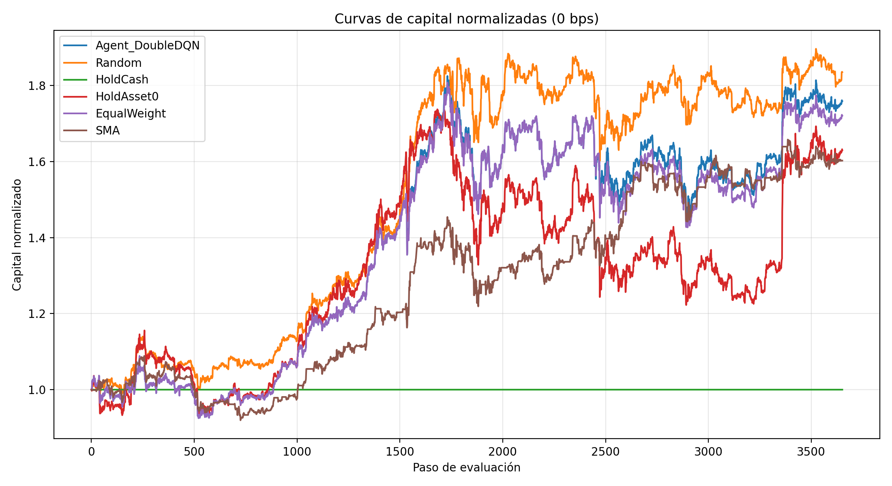
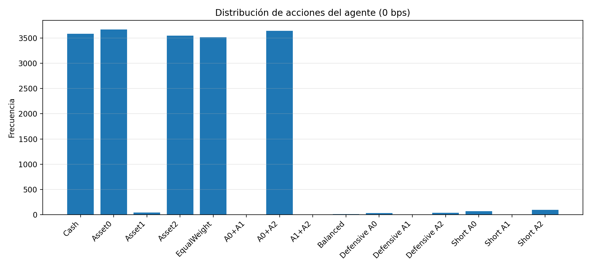
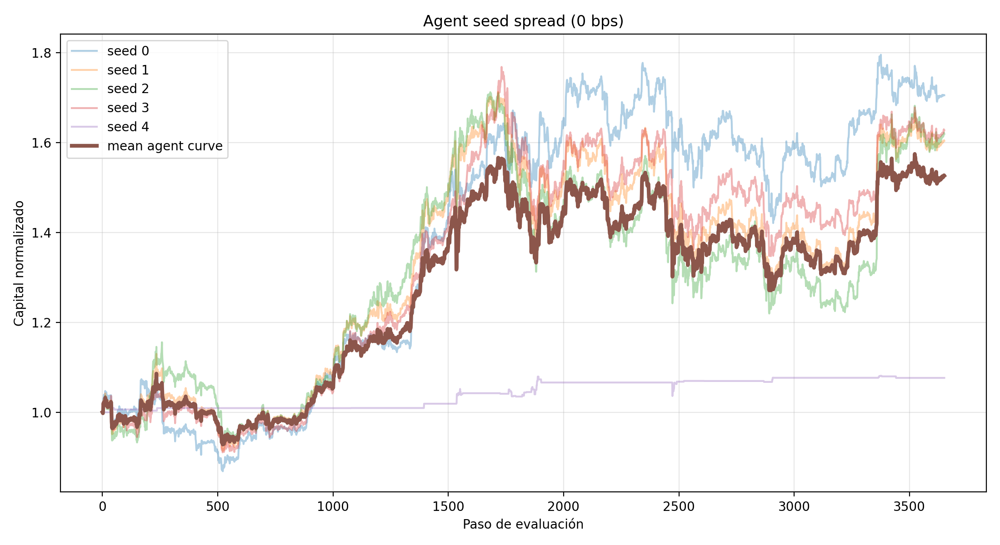
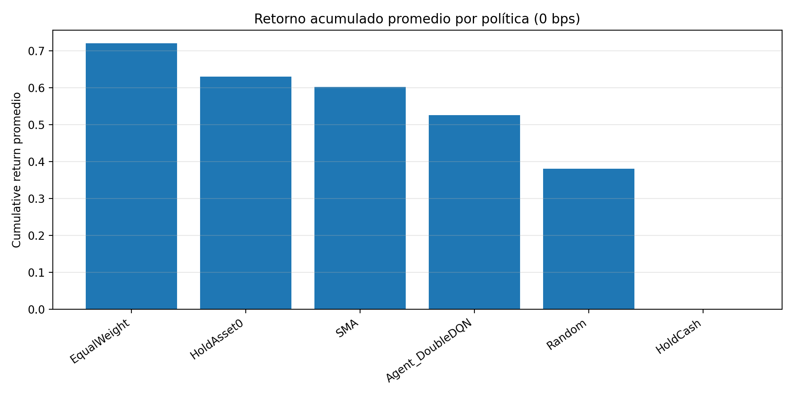
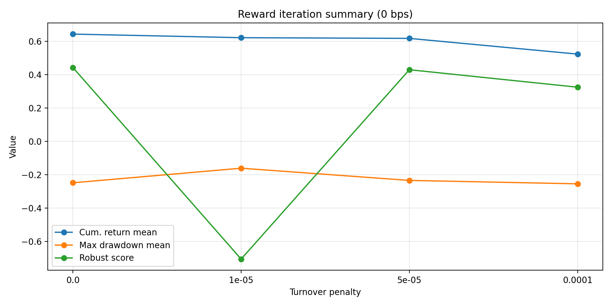

# Metodología del proyecto

## 1. Objetivo del proyecto

El objetivo de este proyecto es construir y evaluar un agente de aprendizaje por refuerzo para asignación dinámica de capital entre cuatro activos: tres activos riesgosos (`asset_0`, `asset_1`, `asset_2`) y un activo defensivo (`cash`).

El agente debe decidir, en cada paso temporal, cómo distribuir el portafolio entre estos activos con el propósito de mejorar el rendimiento ajustado por riesgo. La evaluación no se centra únicamente en obtener el mayor retorno posible, sino en demostrar una metodología rigurosa: evitar lookahead, incorporar costos de transacción, comparar contra baselines y analizar el comportamiento del agente en un período held-out.

---

## 2. Restricciones metodológicas principales

La implementación respeta las siguientes restricciones del proyecto:

1. **No lookahead:** el agente solo usa información disponible hasta el tiempo actual.
2. **Costos de transacción:** se evalúa el agente con `0 bps` y `10 bps`.
3. **Reproducibilidad:** se usa una semilla fija (`seed = 42`) y un pipeline de evaluación separado.
4. **Compatibilidad con el framework:** el archivo oficial `agent.py` define `TradingEnv`, `Agent`, `N_ACTIONS` y `_ACTION_WEIGHTS`.
5. **Separación entre entrega y evidencia:** `agent.py` contiene la implementación principal, mientras que la evaluación, gráficas y resultados se generan mediante scripts externos.

---

## 3. Formulación del problema

### 3.1 Estado

El estado observado por el agente se construye con dos componentes:

```text
[ventana de retornos logarítmicos de los tres activos riesgosos, pesos actuales del portafolio]
```

Con `lookback = 20`, el estado contiene:

```text
20 × 3 + 4 = 64 componentes
```

Esto significa que el agente observa:

* los retornos recientes de `asset_0`;
* los retornos recientes de `asset_1`;
* los retornos recientes de `asset_2`;
* los pesos actuales del portafolio en `[asset_0, asset_1, asset_2, cash]`.

Se usan retornos logarítmicos en lugar de precios crudos porque los precios no son estacionarios y no describen directamente la dinámica reciente del mercado. Los pesos actuales se incluyen porque el costo de transacción depende del cambio entre el portafolio anterior y el nuevo portafolio.

### 3.2 Acción

El espacio de acciones es discreto. Cada acción representa un portafolio completo predefinido. El agente no produce pesos continuos directamente; selecciona un índice entero que se transforma en una asignación de capital.

Cada acción corresponde a un vector:

```text
[asset_0, asset_1, asset_2, cash]
```

El menú de acciones incluye posiciones en cash, posiciones largas, asignaciones diversificadas, asignaciones defensivas y posiciones parcialmente cubiertas con shorts moderados.

Se eligió este diseño porque el framework espera que `Agent.act(obs)` devuelva un entero. Además, los baselines del proyecto asumen que:

* `acción 0 = 100% cash`;
* `acción 1 = 100% asset_0`;
* `acción 4 = equal weight`.

Por esta razón, esos índices se preservan en `_ACTION_WEIGHTS`.

### 3.3 Limitación del espacio de acciones

El agente no puede elegir cualquier combinación continua de pesos. Solo puede escoger entre los portafolios definidos en el menú. Esta limitación reduce expresividad, pero mejora interpretabilidad, estabilidad y compatibilidad con el framework del proyecto.

---

## 4. Ambiente de trading

La clase `TradingEnv` hereda de `BaseTradingEnv`.

La clase base ya gestiona:

* avance temporal;
* cálculo del valor del portafolio;
* costos de transacción;
* turnover;
* validación de pesos;
* cash no negativo;
* límites para posiciones riesgosas.

La subclase `TradingEnv` implementa:

```python
_obs()
_weights_from_action(action)
_reward(prev_value, curr_value)
```

`_obs()` devuelve la observación del agente.
`_weights_from_action(action)` transforma el índice de acción en pesos de portafolio.
`_reward(prev_value, curr_value)` define la señal de aprendizaje.

---

## 5. Recompensa

La recompensa principal es el log-retorno del portafolio:

```text
reward = log(curr_value / prev_value)
```

Esta formulación se eligió porque es simple, estable y está alineada con el crecimiento del capital. Además, el valor `curr_value` ya incorpora el impacto de los costos de transacción calculados por el ambiente.

La implementación también permite una penalización opcional por turnover:

```text
reward = log_return - turnover_penalty × turnover
```

Por defecto, `turnover_penalty = 0.0`, para evitar penalizar dos veces los costos de transacción. Esta variante queda disponible para futuras iteraciones de reward design.

---

## 6. Algoritmo

Se implementa un agente **Double DQN** con arquitectura tipo **Dueling DQN**.

La elección se justifica porque:

* el espacio de acciones es discreto;
* cada acción corresponde a un portafolio interpretable;
* el framework espera una acción entera;
* Double DQN reduce la sobreestimación de Q-values;
* la arquitectura dueling separa el valor general del estado de la ventaja relativa de cada acción.

La red neuronal recibe la observación y produce un Q-value para cada acción disponible.

Durante entrenamiento se usa exploración epsilon-greedy. Al inicio, el agente explora distintos portafolios; con el tiempo, `epsilon` disminuye y el agente explota con mayor frecuencia las acciones con mayor Q-value estimado.

---

## 7. Protocolo de evaluación

La evaluación se realiza mediante `scripts/evaluate_agent.py`.

Configuración usada:

```text
interval: 1h
train_end: 2024-01-01
eval_end: 2024-06-01
train_steps: 200000
seed: 42
transaction_cost_runs: [0.0, 10.0]
```

El agente se entrena únicamente en el período de entrenamiento y luego se evalúa en el período held-out. No se realiza ajuste posterior usando el período de evaluación.

La evaluación se repite en dos escenarios:

* `0 bps`: escenario sin costos de transacción;
* `10 bps`: escenario con costos de transacción.

Esto permite identificar si una política depende de operar excesivamente.

---

## 8. Baselines

El agente se compara contra cinco baselines:

| Baseline    | Interpretación                                    |
| ----------- | ------------------------------------------------- |
| Random      | Política aleatoria; sirve como piso de referencia |
| HoldCash    | Mantener 100% cash                                |
| HoldAsset0  | Mantener 100% asset_0                             |
| EqualWeight | Distribución igual entre activos riesgosos        |
| SMA         | Heurística de momentum basada en medias móviles   |

Todos los baselines se evalúan bajo las mismas condiciones que el agente.

---

## 9. Métricas

Para cada política se reportan:

* cumulative return;
* annualized return;
* annualized volatility;
* Sharpe ratio;
* Sortino ratio;
* maximum drawdown;
* total fees;
* total turnover;
* final portfolio value.

La métrica principal de interpretación es **Sortino ratio**, porque penaliza únicamente la volatilidad negativa.

---

## 10. Resultados principales

### 10.1 Resultados a 0 bps

En ausencia de costos de transacción, el agente obtiene retorno positivo y se comporta de forma cercana a una estrategia equal weight, con algunos cambios ocasionales de asignación.

El agente supera a `HoldAsset0`, `EqualWeight`, `SMA` y `HoldCash`, pero no supera a `Random`.

Este resultado debe interpretarse con cuidado. La política aleatoria presenta un turnover extremadamente alto, pero como no existen costos de transacción en este escenario, dicho comportamiento no es penalizado. Por tanto, el buen desempeño de Random en `0 bps` no representa una estrategia económicamente realista.

### 10.2 Resultados a 10 bps

Al introducir costos de transacción, las políticas de alta rotación se deterioran con fuerza. Random colapsa casi por completo debido a su turnover extremo. SMA también sufre por la acumulación de fees.

El agente mantiene rentabilidad positiva y presenta menor drawdown que las estrategias pasivas riesgosas. Sin embargo, no supera a `HoldAsset0` ni a `EqualWeight`.

Esto indica que el agente aprendió una política relativamente defensiva y robusta frente a costos, pero no logró capturar todo el upside del período de evaluación.

---

## 11. Interpretación de gráficas

### Curvas de capital

Las curvas de capital muestran la evolución del valor del portafolio para el agente y los baselines.

En `0 bps`, Random obtiene el mejor desempeño, pero esto se debe a un entorno sin fricción donde el exceso de trading no es penalizado. En `10 bps`, Random colapsa, mostrando la importancia de incorporar costos de transacción.

El agente mantiene una curva positiva en `10 bps`, aunque por debajo de EqualWeight y HoldAsset0.

### Acciones seleccionadas

En `0 bps`, el agente selecciona principalmente la acción `4`, correspondiente a equal weight entre los activos riesgosos.

En `10 bps`, el agente selecciona principalmente la acción `12`, una asignación más defensiva y parcialmente cubierta:

```text
[-0.25, 0.50, 0.25, 0.50]
```

Esta acción implica short parcial en `asset_0`, exposición larga a `asset_1` y `asset_2`, y 50% en cash.

### Turnover

Los gráficos de turnover muestran que el agente no opera constantemente. La mayor parte del tiempo mantiene la misma asignación, con algunos rebalanceos puntuales.

Esto es positivo porque evita el comportamiento destructivo de políticas de alta rotación bajo costos de transacción.

---

## 12. Discusión

### Reward design y reward hacking

La recompensa principal fue el log-retorno neto del portafolio. Un posible exploit sería operar excesivamente cuando los costos no están activos. Esto se observa en la política Random, que funciona bien en `0 bps` pero colapsa en `10 bps`.

Otro exploit posible sería refugiarse siempre en cash para evitar drawdown. El agente no cae completamente en este comportamiento, pero bajo `10 bps` sí se vuelve más defensivo.

### Sample efficiency

Los datos financieros son limitados y no independientes. A diferencia de entornos simulados, no se pueden generar infinitas trayectorias de mercado real. Esto limita la capacidad del agente para aprender políticas robustas.

### Distribution shift

El período de entrenamiento y el período de evaluación pueden pertenecer a regímenes distintos. Una política útil en entrenamiento puede no generalizar al período held-out.

### Non-stationarity

Las relaciones entre activos, volatilidad y tendencias cambian con el tiempo. Esto hace que el problema sea más difícil que un entorno estacionario típico.

### Long-horizon credit assignment

Una decisión de portafolio puede parecer buena en el corto plazo pero mala en el largo plazo, o al contrario. El reward por paso no siempre captura completamente las consecuencias acumuladas.

---

## 13. Reflexión final

### Tres resultados sorprendentes

1. Random tuvo alto desempeño en `0 bps`, pero colapsó en `10 bps`.
2. El agente aprendió una política de baja rotación, no una política hiperactiva.
3. Bajo costos de transacción, el agente se volvió más defensivo y seleccionó principalmente una acción parcialmente cubierta.

### Dos cambios metodológicos con más tiempo

1. Comparar formalmente recompensas alternativas: penalización por turnover y penalización por drawdown.
2. Ejecutar múltiples seeds para medir estabilidad y evitar depender de una sola trayectoria de entrenamiento.

### Comportamiento no completamente explicado

El predominio de la acción `12` bajo `10 bps` requiere análisis adicional. Puede representar una respuesta defensiva aprendida, pero también puede ser una forma de sobreajuste al período de entrenamiento.

### Brecha entre teoría DRL y aplicación financiera

En teoría, reinforcement learning permite aprender políticas secuenciales óptimas. En la práctica financiera, los datos son limitados, ruidosos, no estacionarios y sensibles a costos. Por eso una política RL puede ser metodológicamente válida sin superar a estrategias pasivas simples.

## 14. Evaluación robusta por múltiples seeds

Después de la evaluación inicial con una sola seed, se ejecutó una evaluación robusta usando cinco semillas: `[0, 1, 2, 3, 4]`. El objetivo fue verificar si el resultado del agente dependía de una trayectoria específica de entrenamiento o si el comportamiento se mantenía de forma consistente.

La configuración usada fue:

```text
interval: 1h
train_end: 2024-01-01
eval_end: 2024-06-01
train_steps: 200000
seeds: [0, 1, 2, 3, 4]
transaction_cost_bps: [0.0, 10.0]
```

### Resultados a 0 bps

En el escenario sin costos de transacción, el agente obtuvo un retorno acumulado promedio de aproximadamente 52.7%, con una desviación estándar cercana a 25.5%. Esto indica que el agente fue rentable en promedio, pero también sensible a la semilla de entrenamiento.

El benchmark EqualWeight obtuvo un retorno acumulado cercano a 72.1%, mientras que HoldAsset0 obtuvo cerca de 63.0%. Por tanto, aunque el agente aprendió exposición rentable a los activos riesgosos, no logró superar las estrategias pasivas más fuertes.

Un resultado importante es que la política Random, que había sido muy fuerte en una evaluación individual, tuvo un retorno promedio menor al del agente al considerar múltiples seeds. Esto muestra por qué no es suficiente reportar una sola corrida.

### Resultados a 10 bps

Con costos de transacción de 10 bps, el agente obtuvo un retorno acumulado promedio cercano a 43.6%, manteniéndose rentable en todas las semillas evaluadas. En contraste, Random colapsó casi por completo y SMA obtuvo resultados negativos debido a su alto turnover.

Esto muestra que el agente es más robusto frente a costos de transacción que las políticas activas de alta rotación. Sin embargo, el agente todavía fue superado por EqualWeight y HoldAsset0, lo que indica que no logró dominar estrategias pasivas simples durante el período held-out.

### Distribución de acciones

A 0 bps, el agente distribuyó sus acciones principalmente entre Cash, Asset0, Asset2, EqualWeight y Asset0 + Asset2. Esto sugiere que, sin costos, diferentes trayectorias de entrenamiento favorecieron distintas exposiciones riesgosas.

A 10 bps, el comportamiento se concentró principalmente en tres acciones: Asset0, EqualWeight y Short Asset1. Esta concentración indica que, bajo costos, el agente redujo el uso de acciones menos frecuentes y adoptó una política más estable.

### Turnover y costos

El agente presentó un turnover promedio mucho menor que Random y SMA. Esto explica por qué no colapsó bajo costos de transacción. La principal fortaleza del agente no fue superar a los benchmarks pasivos, sino evitar el comportamiento destructivo de las políticas de alta rotación.

### Conclusión de la evaluación robusta

La evaluación multi-seed muestra que el agente es metodológicamente válido, rentable en promedio y relativamente robusto a costos de transacción. Sin embargo, también muestra dos limitaciones importantes: sensibilidad a la semilla y bajo desempeño relativo frente a benchmarks pasivos simples.

Por tanto, el resultado debe interpretarse como una primera política RL defendible, no como una solución óptima. Las siguientes iteraciones deberían explorar recompensas alternativas, mayor control de turnover y evaluación con más seeds o ventanas temporales.

## 15. Iteración de recompensa: penalización por turnover

Después de la evaluación robusta multi-seed, se realizó una nueva iteración metodológica enfocada en el diseño de la recompensa. El objetivo fue evaluar si una penalización explícita por turnover podía mejorar el balance entre rentabilidad, estabilidad y control de costos.

La recompensa base usada en la primera versión del agente fue:

```text
reward = log(curr_value / prev_value)
```

Esta recompensa mide el crecimiento logarítmico del valor del portafolio entre dos pasos consecutivos. Como el ambiente ya descuenta los costos de transacción antes de calcular la recompensa, esta señal ya incorpora el impacto económico de los fees.

Sin embargo, se quiso evaluar si una penalización adicional por turnover podía funcionar como regularizador del comportamiento del agente. La variante evaluada fue:

```text
reward = log(curr_value / prev_value) - λ × turnover
```

Donde `λ` representa la intensidad de la penalización por cambios frecuentes en la asignación del portafolio.

Los valores evaluados fueron:

```text
[0.0, 0.00001, 0.00005, 0.0001]
```

La evaluación se realizó con la siguiente configuración:

```text
interval: 1h
train_end: 2024-01-01
eval_end: 2024-06-01
train_steps: 200000
seeds: [0, 1, 2]
transaction_cost_bps: [0.0, 10.0]
```

Para comparar las configuraciones se usaron métricas de retorno acumulado, drawdown, turnover, estabilidad entre seeds y un score auxiliar denominado `robust_score`:

```text
robust_score =
cum_ret_mean
- 0.50 × cum_ret_std
+ 0.50 × max_dd_mean
- 0.0005 × total_turnover_mean
```

Este score no reemplaza las métricas financieras principales. Su función es ordenar configuraciones considerando simultáneamente retorno promedio, variabilidad entre seeds, drawdown y rotación del portafolio.

### Resultado a 0 bps

En el escenario sin costos de transacción, la mejor configuración fue la recompensa original:

```text
turnover_penalty = 0.0
```

Esta configuración obtuvo el mejor balance general. Penalizar el turnover cuando no existen costos de transacción reduce innecesariamente la flexibilidad del agente para cambiar de asignación. Por tanto, en un entorno sin fricción, la penalización adicional por turnover no aporta una mejora metodológica clara.

### Resultado a 10 bps

En el escenario con costos de transacción, la mejor configuración fue:

```text
turnover_penalty = 0.00005
```

Esta configuración obtuvo el mayor retorno acumulado promedio y el mejor `robust_score`. El resultado sugiere que, bajo costos de transacción realistas, el agente se beneficia de una señal adicional que desalienta rebalanceos innecesarios.

La penalización no se interpreta como reemplazo de los costos de transacción, porque estos ya son aplicados por el ambiente. En cambio, se interpreta como un regularizador de comportamiento que ayuda a que el agente aprenda políticas más estables durante el entrenamiento.

### Interpretación metodológica

La iteración muestra que la recompensa original era válida y suficiente para pasar las pruebas del proyecto, pero no necesariamente era la configuración más adecuada para el escenario con costos de transacción.

En presencia de costos, el agente no solo debe buscar crecimiento de capital, sino también evitar cambios frecuentes de portafolio que puedan deteriorar el resultado neto. La penalización pequeña por turnover ayuda a alinear mejor la señal de aprendizaje con el objetivo económico del problema.

El resultado también muestra que el efecto de `λ` no es lineal. Una penalización demasiado pequeña no modifica suficientemente el comportamiento del agente, mientras que una penalización demasiado grande puede limitar su capacidad de adaptación. En esta evaluación, `λ = 0.00005` ofreció el mejor balance.

### Decisión metodológica

Para la evaluación final bajo condiciones realistas de `10 bps`, se considera preferible usar:

```text
turnover_penalty = 0.00005
```

Sin embargo, se mantiene el valor por defecto:

```text
turnover_penalty = 0.0
```

en `agent.py`, para conservar compatibilidad con las pruebas oficiales y evitar modificar la interfaz base del proyecto. La configuración seleccionada se aplica desde los scripts de evaluación.

### Archivos generados

Los resultados de esta iteración se guardaron en:

```text
results/reward_iteration_all_results.csv
results/reward_iteration_agent_summary.csv
results/reward_iteration_metadata.json
```

Las figuras generadas fueron:

```text
figures/reward_iteration_summary_0bps.png
figures/reward_iteration_summary_10bps.png
```

Estos archivos documentan la comparación de configuraciones y sirven como evidencia para la sección de reward design de la rúbrica.

## 16. Integración de hallazgos en la versión final del agente

Después de completar la evaluación inicial, la comparación robusta por múltiples seeds y la iteración de recompensa, se tomó una decisión metodológica final sobre la configuración del agente.

La primera versión del agente usaba como recompensa:

```text
reward = log(curr_value / prev_value)
```

Esta recompensa fue válida y permitió obtener una política funcional. Sin embargo, la evaluación con costos de transacción mostró que el agente podía mejorar si la señal de aprendizaje incluía una regularización adicional sobre el turnover.

Por esta razón, se evaluó la siguiente variante:

```text
reward = log(curr_value / prev_value) - λ × turnover
```

Los valores evaluados fueron:

```text
λ ∈ [0.0, 0.00001, 0.00005, 0.0001]
```

La evaluación se realizó bajo dos escenarios:

- `0 bps`, para observar el comportamiento sin costos de transacción.
- `10 bps`, para evaluar el comportamiento bajo costos realistas de rebalanceo.

La configuración que mostró mejor balance bajo `10 bps` fue:

```text
turnover_penalty = 0.00005
```

Esta configuración obtuvo el mayor retorno acumulado promedio y el mejor `robust_score` en el escenario con costos de transacción. Por esta razón, se integró como configuración metodológica final del ambiente.

Es importante aclarar que esta penalización no reemplaza los costos de transacción. El ambiente ya descuenta fees directamente del valor del portafolio. La penalización por turnover se interpreta como un regularizador de comportamiento: ayuda al agente a evitar rebalanceos innecesarios y a aprender políticas más estables.

---

## 17. Evidencia visual usada para justificar la configuración final

Las figuras generadas durante la evaluación se incluyen en el repositorio como evidencia metodológica. Estas figuras respaldan las decisiones tomadas sobre el diseño del estado, el espacio de acciones, la recompensa y la configuración final del agente.

### 17.1 Curvas de capital

Las curvas de capital muestran la evolución del valor del portafolio del agente frente a los baselines.



En el escenario `0 bps`, algunas políticas de alta rotación pueden parecer competitivas porque no pagan costos de transacción. Esta figura muestra por qué una evaluación sin fricción puede ser engañosa: una política puede obtener buenos resultados simplemente porque no se penaliza el exceso de rebalanceos.


En el escenario `10 bps`, las políticas de alta rotación, especialmente `Random` y `SMA`, se deterioran fuertemente. El agente mantiene una trayectoria positiva, aunque no supera a los benchmarks pasivos más fuertes como `EqualWeight` y `HoldAsset0`.

Esto permite concluir que la principal fortaleza del agente no es dominar todos los benchmarks, sino mantener un comportamiento más robusto que las políticas activas de alta rotación cuando existen costos de transacción.

### 17.2 Distribución de acciones



A `0 bps`, el agente distribuye sus acciones entre varias posiciones riesgosas y defensivas. Esto muestra que, sin costos, el agente tiene más libertad para explorar distintas asignaciones de capital.


A `10 bps`, el agente concentra su comportamiento en menos acciones. Esto indica que bajo costos de transacción aprende una política más estable y menos dispersa. Esta concentración también sugiere que el agente reduce la frecuencia de cambios innecesarios cuando los rebalanceos tienen impacto económico.

### 17.3 Acciones seleccionadas durante evaluación


En la evaluación individual a `0 bps`, el agente selecciona principalmente una acción dominante asociada a exposición diversificada, con cambios puntuales hacia otras acciones. Esto muestra que el agente no actúa de forma aleatoria, sino que aprende una preferencia de asignación relativamente estable.


En la evaluación individual a `10 bps`, el agente mantiene durante largos períodos una acción principal y realiza pocos cambios. Esta conducta es consistente con la necesidad de reducir rebalanceos cuando existen costos de transacción.

### 17.4 Turnover del agente


El gráfico de turnover a `0 bps` muestra que el agente no cambia de asignación constantemente. La mayoría del tiempo mantiene el mismo portafolio, con algunos picos aislados de rebalanceo.


El gráfico de turnover a `10 bps` muestra un comportamiento similar: el agente presenta picos puntuales, pero no opera de forma hiperactiva. Esto respalda la idea de que el agente tiene un comportamiento más estable que baselines como `Random` y `SMA`.

### 17.5 Dispersión por seed



La dispersión por seed a `0 bps` muestra que el entrenamiento del agente es sensible a la inicialización y a la trayectoria de exploración. Algunas seeds generan políticas más rentables que otras. Esto justifica no reportar únicamente una corrida individual.


La dispersión por seed a `10 bps` muestra que, aunque el agente mantiene rentabilidad positiva en varias configuraciones, todavía existe variabilidad entre entrenamientos. Este resultado evidencia una limitación importante del enfoque: el agente puede aprender políticas válidas, pero su desempeño no es completamente estable entre seeds.

### 17.6 Comparación promedio por política



A `0 bps`, el agente es rentable, pero no supera consistentemente a `EqualWeight`. Esto muestra que la estrategia RL no debe presentarse como claramente superior a los benchmarks pasivos.


A `10 bps`, el agente supera a políticas activas de alta rotación como `Random` y `SMA`, pero sigue por debajo de `EqualWeight` y `HoldAsset0`. Esto confirma que su principal fortaleza es la robustez frente a costos, no la dominancia absoluta en retorno.

### 17.7 Iteración de recompensa



En `0 bps`, la recompensa original sin penalización por turnover fue suficiente. Penalizar turnover en un entorno sin costos reduce innecesariamente la flexibilidad del agente.


En `10 bps`, la mejor configuración fue `turnover_penalty = 0.00005`. Esta figura justifica la integración de esa penalización como configuración final del agente, ya que mejora el balance entre retorno acumulado, drawdown, turnover y estabilidad.

---

## 18. Racional final de configuración del agente

La configuración final del agente se basa en las siguientes decisiones metodológicas.

### 18.1 Estado

El estado incluye una ventana de retornos logarítmicos y los pesos actuales del portafolio:

```text
[retornos recientes de asset_0, asset_1, asset_2, pesos actuales]
```

Esta decisión permite que el agente observe la tendencia reciente de los activos riesgosos y, al mismo tiempo, conozca su asignación actual. Esto es importante porque los costos de transacción dependen del cambio entre el portafolio anterior y el nuevo portafolio.

Usar retornos logarítmicos en lugar de precios crudos también evita que el agente aprenda únicamente niveles de precio, los cuales no son estacionarios. Los retornos representan mejor la dinámica reciente del mercado.

### 18.2 Acción

Se usa un menú discreto de portafolios interpretables. Esta decisión se tomó porque el framework exige acciones enteras y porque facilita explicar económicamente cada decisión del agente.

Cada acción representa una asignación completa:

```text
[asset_0, asset_1, asset_2, cash]
```

El menú preserva las convenciones de los baselines:

```text
acción 0 = cash
acción 1 = asset_0
acción 4 = equal weight
```

Esto permite comparar el agente contra `HoldCash`, `HoldAsset0` y `EqualWeight` sin romper el significado esperado de esas políticas.

La principal limitación de este enfoque es que el agente no puede escoger pesos continuos arbitrarios. Sin embargo, esta restricción mejora la interpretabilidad, reduce la complejidad de entrenamiento y mantiene compatibilidad con el sistema de evaluación.

### 18.3 Recompensa

La recompensa final usa log-retorno neto del portafolio con una penalización pequeña por turnover:

```text
reward = log(curr_value / prev_value) - 0.00005 × turnover
```

Esta configuración fue seleccionada porque produjo el mejor balance bajo costos realistas de transacción.

La penalización por turnover no reemplaza los costos de transacción. El ambiente ya descuenta los fees directamente del valor del portafolio. La penalización funciona como una señal adicional de aprendizaje para inducir un comportamiento más estable y reducir rebalanceos innecesarios.

### 18.4 Algoritmo

Se usa un agente `Double DQN` con arquitectura tipo `Dueling DQN`.

Esta elección es adecuada porque:

- el espacio de acciones es discreto;
- cada acción corresponde a un portafolio interpretable;
- `Double DQN` ayuda a reducir la sobreestimación de valores Q;
- la arquitectura `Dueling DQN` separa el valor general del estado de la ventaja relativa de cada acción.

El agente usa exploración `epsilon-greedy` durante entrenamiento. Al inicio explora más acciones; con el tiempo, `epsilon` disminuye y el agente explota con mayor frecuencia las acciones con mayor Q-value estimado.

### 18.5 Evaluación

La evaluación se realizó con:

```text
interval: 1h
train_end: 2024-01-01
eval_end: 2024-06-01
train_steps: 200000
costos: 0 bps y 10 bps
seeds: múltiples seeds
```

La comparación incluyó:

- `Random`
- `HoldCash`
- `HoldAsset0`
- `EqualWeight`
- `SMA`

Las métricas consideradas fueron:

- retorno acumulado;
- retorno anualizado;
- volatilidad anualizada;
- Sharpe ratio;
- Sortino ratio;
- maximum drawdown;
- fees totales;
- turnover total;
- valor final del portafolio.

### 18.6 Conclusión metodológica

El agente final no debe interpretarse como una estrategia que domina a todos los benchmarks. Su resultado más importante es metodológico: aprende una política rentable, interpretable y relativamente robusta frente a costos de transacción.

Sin embargo, estrategias pasivas simples como `EqualWeight` siguen siendo difíciles de superar en el período held-out. Esto muestra una brecha importante entre la teoría de reinforcement learning y su aplicación financiera: una política RL puede estar correctamente formulada y ser funcional, pero no necesariamente superar estrategias simples en mercados ruidosos, no estacionarios y con datos limitados.

---

## 19. Verificación final de funcionamiento

Antes de la entrega final, se ejecutó nuevamente la suite oficial de pruebas del proyecto:

```bash
uv run python -m pytest tests/test_submission.py -v
```

El resultado fue satisfactorio: todas las pruebas fueron aprobadas.

Esta verificación confirma que el archivo `agent.py` cumple con la interfaz esperada por el framework de evaluación. En particular, se comprobó que el archivo define correctamente:

```text
TradingEnv
Agent
N_ACTIONS
_ACTION_WEIGHTS
```

Además, las pruebas verificaron que:

- el ambiente se puede instanciar correctamente;
- `reset()` devuelve observaciones con la forma y tipo esperados;
- `step()` funciona para todas las acciones disponibles;
- todos los vectores de pesos suman 1;
- el peso de `cash` no es negativo;
- los pesos de activos riesgosos están dentro de los límites permitidos;
- la recompensa es finita y tiene el signo correcto cuando el portafolio sube o baja;
- `Agent.act(obs)` devuelve una acción válida;
- la política es determinista durante evaluación;
- el entrenamiento corto se ejecuta sin errores;
- `epsilon` disminuye durante el entrenamiento;
- un rollout completo mantiene valores de portafolio positivos y finitos.

Esta etapa es importante porque separa la validez técnica mínima de la evaluación metodológica. Pasar los tests no demuestra que el agente sea financieramente superior, pero sí demuestra que la implementación es compatible con el entorno oficial y puede ser evaluada por el docente sin errores de interfaz.

---

## 20. Cierre del proceso metodológico

El proceso completo siguió una secuencia incremental:

1. Construcción de una primera versión compatible con el framework.
2. Verificación con la suite oficial de pruebas.
3. Evaluación inicial contra baselines.
4. Evaluación robusta por múltiples seeds.
5. Iteración de recompensa mediante penalización por turnover.
6. Integración de la mejor configuración encontrada en la versión final del agente.
7. Documentación de resultados, limitaciones y evidencia visual.

La decisión final fue conservar un agente `Double DQN` con espacio de acciones discreto, observación basada en retornos recientes y pesos actuales, y recompensa regularizada por turnover.

El resultado final es una solución funcional, testeada y metodológicamente defendible. El agente no se presenta como una estrategia financiera superior en todos los escenarios, sino como una implementación de reinforcement learning capaz de aprender una política interpretable, rentable en varias configuraciones y más robusta que políticas activas de alta rotación cuando se introducen costos de transacción.